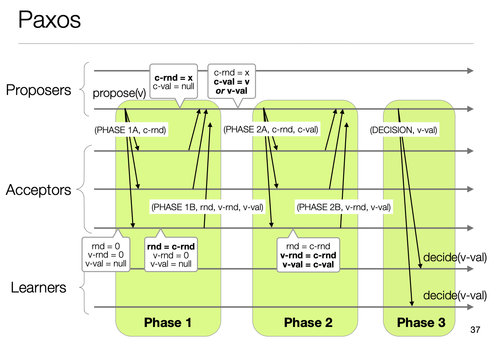
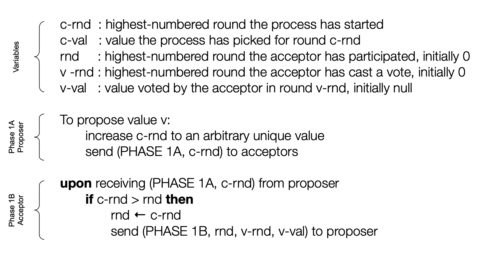
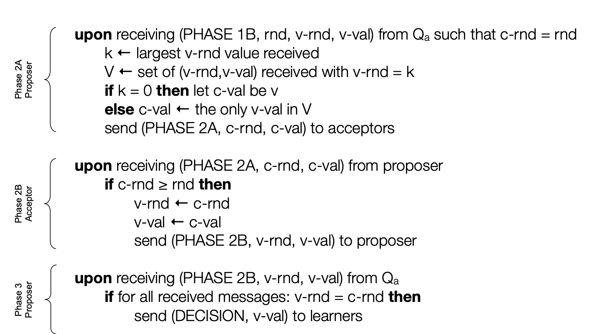

# Multi-Paxos: Atomic Broadcast Implementation

An implementation of the Paxos consensus protocol for solving **atomic broadcast** - the problem of having a set of processes agree on a sequence of totally ordered values in an asynchronous distributed system.

## Project Overview

Paxos is a protocol used to solve consensus in asynchronous systems. While basic consensus allows processes to agree on a single value, this implementation extends Paxos to support **atomic broadcast**, where processes agree on a sequence of totally ordered values.

### Roles

The implementation provides four distinct roles communicating via IP multicast:

| Role | Responsibility |
|------|----------------|
| **Clients** | Submit values to proposers |
| **Proposers** | Coordinate Paxos rounds to propose values to be decided |
| **Acceptors** | Paxos acceptors that vote on proposals |
| **Learners** | Learn about the sequence of values as they are decided |

### Architecture

```
┌─────────┐     ┌───────────┐     ┌───────────┐     ┌─────────┐
│ Clients │────▶│ Proposers │────▶│ Acceptors │────▶│ Learners│
└─────────┘     └───────────┘     └───────────┘     └─────────┘
                     │                  │                │
                     └──────────────────┴────────────────┘
                           IP Multicast Groups
```

## Implementation Milestones

### 1. Synod Algorithm
The basic version of Paxos supporting the decision of a **single value**.

#### Protocol Overview

The Synod algorithm consists of two phases:



*The complete Synod (single-decree Paxos) protocol showing both phases and all message types.*

#### Phase 1: Prepare



*Phase 1 (Prepare): The proposer sends a prepare request with round number `c-rnd`. Acceptors respond with their highest accepted round and value.*

#### Phase 2: Accept



*Phase 2 (Accept): The proposer sends an accept request. Acceptors accept if the round number is valid and notify learners.*

#### Notation

| Symbol | Meaning |
|--------|---------|
| `c-rnd` | Proposer's current round number |
| `rnd` | Acceptor's highest promised round |
| `v-rnd` | Round in which acceptor last accepted a value |
| `v-val` | Value the acceptor last accepted |
| `c-val` | Value the proposer is trying to get accepted |

### 2. Multi-Paxos
Extension of the Synod algorithm to support **atomic broadcast** - the decision of multiple values in the same total order.

### 3. Optimizations

| Optimization | Description |
|--------------|-------------|
| **Direct 2B to Learners** | Acceptors send Phase 2B messages directly to learners, saving one communication step |
| **Proactive Phase 1** | Proposers perform Phase 1 before receiving values from clients, saving two communication steps on the critical path |
| **Batching** | Multiple values can be decided in a single Synod instance, improving throughput |

## Safety and Liveness Guarantees

### Safety (Always Guaranteed)
- **Total Order**: All learners deliver values in the same order
- **Agreement**: All learners eventually learn the same set of values  
- **Integrity**: Only values proposed by clients are learned

**Message loss or process crashes never violate safety.**

### Liveness
- If a **majority of acceptors** are alive, progress can be made
- Learning values is possible with a majority of acceptors and at least one of each other role (no crashes or message loss)
- Multiple proposers are supported; if two proposers conflict, they will keep trying until one succeeds

> **Note**: This implementation does not include leader election. No assumptions are made about which proposer is the leader.

## Failure Model

The implementation assumes **crash failures**:
- Processes fail by halting and do not recover
- No Byzantine faults
- All state is kept in memory (no stable storage needed)
- No recovery procedure for acceptors or learners

## Communication Model

- **Asynchronous network**: No timing guarantees on message delivery
- **IP Multicast only**: Four separate multicast groups (one per role)
- **No synchrony**: No use of `time.sleep()` or similar timing mechanisms in the protocol

## Prerequisites

- Ubuntu 24.04 (or compatible Linux distribution)
- Python 3.10+
- `jq` (for config generation): `sudo apt install jq`
- `gnuplot` (optional, for latency plots): `sudo apt install gnuplot`
- Network interface with multicast enabled

### Enabling Multicast

Check if multicast is enabled on your interface:

```bash
ifconfig
```

Look for the `MULTICAST` flag. If missing, enable it:

```bash
sudo ifconfig <INTERFACE> multicast
```

> **Note**: Running in a virtual machine (e.g., Multipass) is recommended as some scripts use `iptables` to simulate message loss.

## Quick Start

1. Clone the repository and navigate to the project directory:

```bash
git clone https://github.com/yourusername/paxos-implementation.git
cd paxos-implementation
```

2. Make scripts executable:

```bash
chmod +x scripts/*.sh
```

3. Run a basic test:

```bash
scripts/run.sh -n 100
scripts/check.sh
```

## Usage

### Running the System

```bash
scripts/run.sh [OPTIONS]
```

**Options:**

| Flag | Description | Default |
|------|-------------|---------|
| `-n, --num NUM` | Number of values per client | 5 |
| `-b, --batch NUM` | Batch size for proposers | 1 |
| `-c, --clients NUM` | Number of clients | 2 |
| `-p, --proposers NUM` | Number of proposers | 2 |
| `-a, --acceptors NUM` | Number of acceptors | 3 |
| `-l, --learners NUM` | Number of learners | 2 |
| `--loss RATE` | Packet loss probability (0.0-1.0) | 0.0 |
| `--catchup` | Start learner late to test catch-up | - |
| `-s, --sleep SEC` | Sleep duration between phases | 2 |
| `--ip ADDRESS` | Multicast IP address | 239.1.2.3 |
| `-d, --debug` | Enable debug logging | - |

### Examples

Run with 1000 values per client:

```bash
scripts/run.sh -n 1000
```

Test with 10% packet loss (safety must still hold):

```bash
scripts/run.sh -n 100 --loss 0.1
```

Test learner catch-up:

```bash
scripts/run.sh -n 500 --catchup
```

Use batching for higher throughput:

```bash
scripts/run.sh -n 1000 -b 10
```

### Verifying Results

```bash
scripts/check.sh
```

This verifies:
1. **Total Order**: All learners agree on the same ordered sequence
2. **Integrity**: All learned values were actually proposed
3. **Agreement**: All proposed values were learned

### Generating Latency Plots

```bash
scripts/run.sh -n 1000 -l 0
gnuplot scripts/plotting/cdf.gp
gnuplot scripts/plotting/cartesian.gp
```

Plots are saved to `logs/plot_cdf.pdf` and `logs/plot_cartesian.pdf`.

## Troubleshooting

**Processes still running after Ctrl+C:**

```bash
scripts/cleanup.sh
```

**Firewall rules blocking multicast:**

```bash
sudo iptables -L INPUT -v --line-numbers
scripts/cleanup.sh
```

**Not all values learned:**

- Increase sleep time: `scripts/run.sh -s 5 -n 1000`
- Check if multicast is enabled on your network interface

## Project Structure

```
.
├── docs/
│   └── images/        # Protocol diagrams
│       ├── synod_paxos.png
│       ├── Phase_1.png
│       └── Phase2.png
├── src/
│   ├── main.py        # Entry point and argument parsing
│   ├── client.py      # Client: submits values to proposers
│   ├── proposer.py    # Proposer: coordinates Paxos rounds (Phase 1A/2A)
│   ├── acceptor.py    # Acceptor: votes on proposals (Phase 1B/2B)
│   ├── learner.py     # Learner: learns decided values in total order
│   └── utils.py       # Multicast socket utilities
├── scripts/
│   ├── run.sh         # Main execution script
│   ├── check.sh       # Verification script (safety checks)
│   ├── cleanup.sh     # Process/firewall cleanup
│   └── plotting/      # Gnuplot scripts for latency analysis
├── DESIGN.md          # Detailed design documentation
├── LICENSE            # MIT License
└── README.md
```

## Design Details

See [DESIGN.md](DESIGN.md) for detailed information about:

- Message types and protocol flow
- Batching and proactive prepare optimizations
- Learner catch-up mechanism
- Quorum requirements and total order delivery

## License

MIT License - see [LICENSE](LICENSE) for details.
